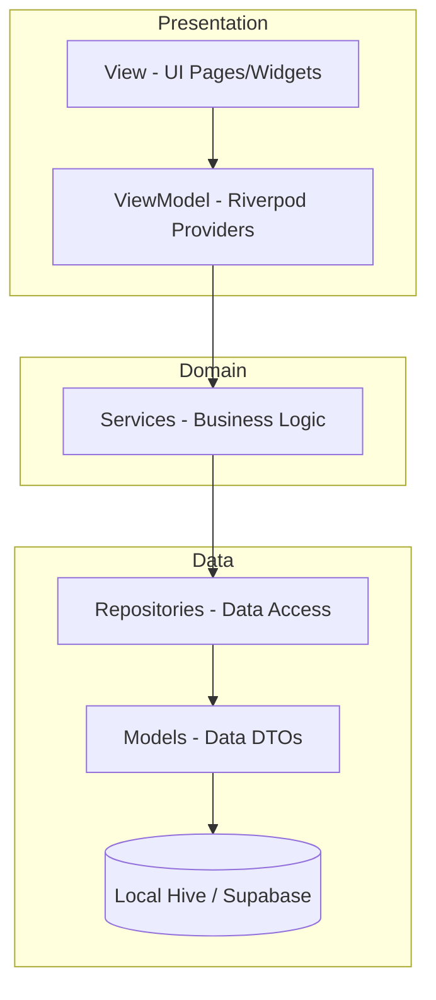

# Vatsalya: Maternal & Infant Care 🤱👶

[](https://flutter.dev)
[](https://dart.dev)
[](https://en.wikipedia.org/wiki/Model%E2%80%93view%E2%80%93viewmodel)
[](https://supabase.com)
[](https://ai.google.dev/)

**Vatsalya** is a premium, feature-rich mobile application designed to be a companion for parents through the beautiful journey of pregnancy and early childhood. Built with **Production-Grade Clean MVVM Architecture**, it combines health tracking, medical records, and AI-powered intelligence to provide a seamless care experience.

---

## 📑 Table of Contents
- [✨ Key Modules](#-key-modules)
- [🤖 Intelligence Layer](#-intelligence-layer)
- [🏗️ Architectural Excellence](#️-architectural-excellence)
- [🛠️ Tech Stack](#️-tech-stack)
- [🚀 Quick Start](#-quick-start)
- [📝 Configuration](#-configuration)
- [📊 Project Roadmap](#-project-roadmap)
- [🔒 Privacy & Security](#-privacy--security)

---

## ✨ Key Modules

### 🤰 Pregnancy Tracking & Pre-Birth Care
Empowering mothers-to-be with daily insights and monitoring tools.
- **Monthly Journey Tracker**: 9-month interactive timeline with fetal development visuals (`assets/images/fetus_m1.png` - `m9`).
- **Health Monitoring**: Smart checklists for medical tests, nutrition, and lifestyle adjustments.
- **Labor Support**: Professional-grade contraction timer and fetal kick counter.
- **Risk Detection**: Immediate alerts for high-risk symptoms and emergency contact triggers.

### 👶 Post-Delivery & Infant Intelligence
Comprehensive tools to monitor your baby's growth and health.
- **Activity Logging**: Precision tracking for Feeding (Breast/Formula/Solid), Sleep patterns, and Diaper changes.
- **Growth Mastery**: Track weight, height, and head circumference with interactive visual charts (`fl_chart`).
- **Milestone Engine**: Monitor developmental stages (physical, cognitive, social) tailored to your baby's age.

### 💉 Medical & Vaccination Hub
Never miss a vital health milestone.
- **Indian Vaccination Schedule**: Pre-configured schedule based on national guidelines.
- **Auto-Scheduler**: Smart notification system that triggers reminders before scheduled dates.
- **Exportable Records**: Generate professional PDF reports of medical history and vaccine logs.

---

## 🤖 Intelligence Layer

### 🧠 CareFlow AI
Integration with **Google Gemini Pro** provides a context-aware assistant:
- **Personalized Advice**: Responses tailored to your pregnancy stage or baby's age.
- **Health Literacy**: Simplified explanations for complex medical topics.
- **History Aware**: Maintains context across sessions for a more human-like conversation.

### 🔔 Smart Reminder Engine
A background service that analyzes your data to provide:
- **Contextual Prompts**: Reminders to log feeding if a gap is detected.
- **Predictive Scheduling**: Suggestions based on baby's established patterns.
- **Health Alerts**: Notifications for upcoming doctor visits or vaccination windows.

---

## 🏗️ Architectural Excellence

The project follows a **strict MVVM (Model-View-ViewModel)** pattern, ensuring a clean separation of concerns and high testability.



### Layer Responsibilities
- **Presentation**: UI rendering and user event capturing. Uses **Riverpod** for reactive state updates.
- **Domain**: Pure business rules and logic (e.g., `SmartReminderEngine`).
- **Data**: Management of persistence and external API communication.
- **Core**: Cross-cutting concerns like Themes, Constants, and Utils.

---

## 🛠️ Tech Stack

| Category | Tools |
| :--- | :--- |
| **Framework** | Flutter 3.0+, Dart 3.0+ |
| **State Management** | Riverpod 2.4+ (Annotated) |
| **Database** | Hive (NoSQL Local), Supabase (PostgreSQL Cloud) |
| **AI/ML** | Google Generative AI (Gemini Pro) |
| **Design** | Material 3, Google Fonts, Lottie Animations, Staggered Grid |
| **Analytics** | FL Chart |
| **Utilities** | Local Notifications, PDF Generator, Dotenv |

---

## 🚀 Quick Start

### 1. Environment Preparation
- Ensure Flutter SDK (>=3.0.0) is installed.
- Have a physical device or emulator ready for testing.

### 2. Fork & Clone
```bash
git clone https://github.com/MadhavK3/HM022_TheHustlers.git
cd HM022_TheHustlers
```

### 3. Dependency & Code Generation
```bash
flutter pub get
flutter pub run build_runner build --delete-conflicting-outputs
```

### 4. Run Application
```bash
flutter run
```

---

## 📝 Configuration

Create a `.env` file in the root directory and populate it with your credentials:

```properties
# Supabase Configuration
SUPABASE_URL=https://your-project.supabase.co
SUPABASE_ANON_KEY=your-anon-public-key

# AI Configuration
GEMINI_API_KEY=your-google-ai-studio-key
```

---

## 📊 Project Roadmap

- [x] **v1.0.0**: Core tracking modules (Pregnancy/Infant) & Architecture Reorg.
- [x] **v1.1.0**: Gemini AI Integration (CareFlow AI).
- [x] **v1.2.0**: Smart Notification Engine & PDF Exports.
- [ ] **v1.3.0**: Community Forum & Peer Support.
- [ ] **v1.4.0**: Multi-language support (i18n).
- [ ] **v2.0.0**: Real-time Sync with Healthcare Providers.

---

## 🔒 Privacy & Security

- **Local-First**: Sensitive logs (feeding, sleep, etc.) are primarily stored in Hive for privacy.
- **Secure Auth**: Powered by Supabase Auth with encrypted sessions.
- **Secret Management**: All API keys are managed via `.env` and never hardcoded.
- **Zero Tracking**: No third-party analytics trackers are used to ensure family privacy.

---

**Developed with ❤️ by The Hustlers**  
*Maternal & Infant health is a human right. Vatsalya aims to make it organized.*
